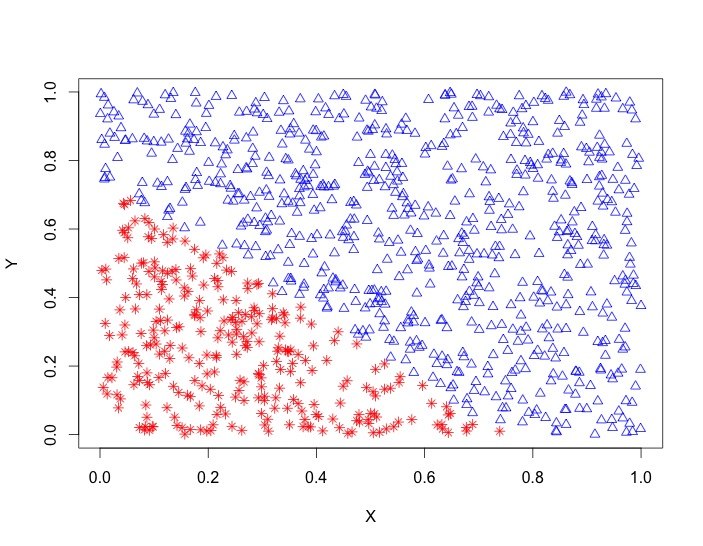
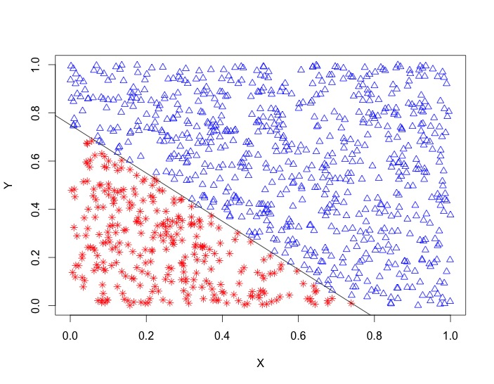
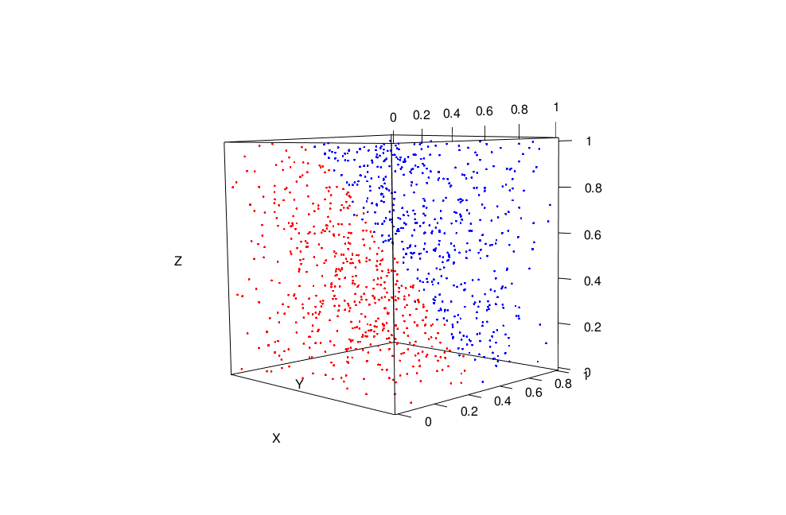
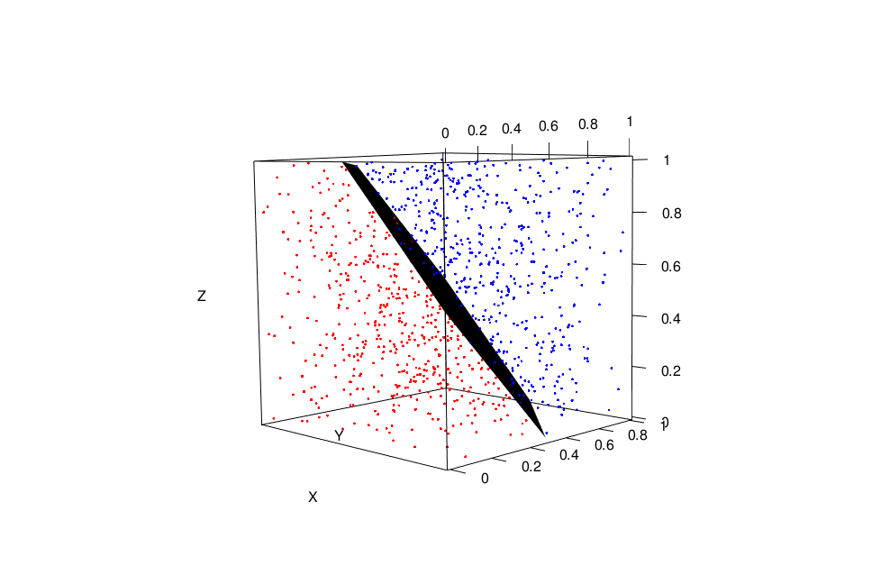

Perceptrons
==
Here we take a look at one of the simplest learning algorithms in machine learning. At its simplest, a percetron takes a vector of inputs **x** = (x1, x2, . . . , xn), weights each component, and outputs a binary variable, "yes" or "no", depending on whether a weighted sum exceeds some pre-determined threshold. We can visualize the weighted inputs as such:  

Let's ground ourselves in a concrete example to flesh out some of these ideas a bit more. If we are a bank that lends money there should be some processes by which we decide to grant, or not grant, credit to a customer. Then each component of **x** is an attribute of our customer such as age, outstanding debt, or number of dependents. 

Given training data our perceptron learns a set of weights to assign to each of these attributes. If a single attribute, say *xd*, ends up being important in classifying good borrowers we would expect our perceptron to give a substantial amount of weight to that factor. Weights can be negative as well and actually count against customers. If, for instance, a customer has a lot of outstanding debt we would not want them to break the threshold and grant them credit. 

Our decision rule for classifying a single observation is then *f*(**x**) = sign(<**w**, **x**>), where the brackets denote the dot-product of two vectors. Take a look at `Classify` in the source code to see exactly how simple this is. Our binary classifier gives us a 1 or -1 depending on the sign of the dot product. In our example, these would correspond to granting or not granting credit, respectively. Interpreting the perceptron's decision boundary geometrically, we see it is exactly a hyperplane and thus our perceptron is really only good for classifying linearly separable data.

Learning
==
So where exactly do these weights come from? This is where our learning algorithm comes in. We briefly outline the steps it takes here, but for a more in-depth look check out the `Perceptron` function in the R source file.

1. Initialize w0 = - threshold and all other weights to random values (I use random uniform but random normal are OK).
2. While any point is misclassified:
   ..1. For each observation:
	..1. If label and classification conflict, update weight and continue

That's it, pretty simple. In each iteration we compute our "expected" classification for each observation. If that expectation does not match the label for that observation, the weights are updated accordingly so that we are more likely to correctly classify that observation in the future.

Examples
==
2D
---
As is, the code can handle as many dimensions as you'd like but for simplicity's sake I'd like to show an example in 2D and one in 3D.

In 2D we set our threshold to 0.75 and generate our data using `Random.Unit(1000, 2, 0.75)`:  

The true decision boundary is *y = -x + 0.75*. We then call `Perceptron` using the output from `Random.Unit` and our threshold and find the line *y = -0.9965821x + -0.7490508*, a pretty good approximation: 

3D
--
In 3D, we use a different threshold of 1.5 and generate data using an analagous call to `Random.Unit`, only this time specifying we want three-dimensional points:

Here, the true decision boundary is a plane of the form *x + y + z = 1.5*. Again using the output straight from `Random.Unit` as the input to `Perceptron`, we are able to find the plane *1.0077008x + 1.0021209y + 0.9928143z = -1.5000002*:

